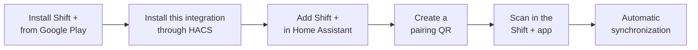

# Shift + for Home Assistant

  

<h3 align="center">Bring your roster into Home Assistant</h3>

  The official Home Assistant companion integration for the Shift + Android
  roster app, maintained by GIBBO.

  <a href="https://play.google.com/store/apps/details?id=ie.shiftplus.app"><strong>Get Shift + on Google Play</strong></a>
  ·
  <a href="#install-through-hacs">Install with HACS</a>
  ·
  <a href="https://github.com/bgibbo/shift-plus-home-assistant/issues">Support</a>

Shift + is the Android app for planning rotating rosters, viewing daily duties,
recording annual leave and tracking overtime. This integration brings supported
Shift + information into Home Assistant for dashboards and automations.

Home Assistant synchronization requires **Shift + Premium**. The Android app
remains the source of truth for roster setup and editing.

## What you get

| Capability | Home Assistant experience |
|---|---|
| Secure pairing | Pair locally by scanning a short-lived, single-use QR code |
| Automatic synchronization | Supported changes flow between Shift + and Home Assistant |
| Active configuration | View the active roster and unit identifiers |
| Annual leave | See synchronized leave totals, today status and the next leave date |
| Overtime | See total hours, entry count and the next overtime date |
| Calendar data | Use sanitized annual-leave and overtime events in the supplied roster card |
| Connection status | Monitor paired devices, synchronization and Premium status |

Shift + on Android displays the full daily roster experience, including current
and next duties and book-on/book-off information. The released Home Assistant
5.0.1 integration exposes the five sensors listed below. It does **not** transfer
computed daily E/L/N/R duties, Current Shift, Next Shift, or book-on/book-off
entities to Home Assistant.

## How it works

## Prerequisites

- Home Assistant 2024.7.0 or newer
- [HACS](https://www.hacs.xyz/) installed and configured
- [Shift + for Android](https://play.google.com/store/apps/details?id=ie.shiftplus.app)
- An active Shift + Premium purchase through Google Play
- Network access from the Android device to Home Assistant

## Install through HACS

This integration is initially distributed as a HACS custom repository.

1. Open **HACS** in Home Assistant.
2. Open the three-dot menu and select **Custom repositories**.
3. Enter:
   `https://github.com/bgibbo/shift-plus-home-assistant`
4. Select **Integration** as the repository type and choose **Add**.
5. Find **Shift +** in HACS and choose **Download**.
6. Restart Home Assistant when prompted.
7. Open **Settings → Devices & services → Add integration**, search for
   **Shift +**, and complete the setup form.

## Pair the Android app

1. In Home Assistant, open **Developer Tools → Actions**.
2. Run **Shift +: Create pairing QR** (`shift_plus.create_pairing`).
3. Open the persistent notification created by Home Assistant.
4. In the Shift + Android app, open **Home Assistant** and scan the QR code.
5. Wait for the app to confirm pairing and the initial synchronization.

The QR expires after five minutes and can be used once. Pairing requires an
active Shift + Premium entitlement.

> **Screenshot safety:** never share or publish a live pairing QR. It contains
> short-lived pairing credentials.

## Home Assistant entities

The integration creates five sensors on the **Shift +** device:

| Entity | State and purpose |
|---|---|
| `sensor.shift_paired_devices` | Paired-device count, sync status and Premium status |
| `sensor.shift_active_roster` | Active roster ID, with roster and unit attributes |
| `sensor.shift_calendar` | Count of sanitized annual-leave and overtime events |
| `sensor.shift_annual_leave` | Leave-day total, today status and next leave date |
| `sensor.shift_overtime` | Overtime hours, entry count and next overtime date |

Home Assistant may add a suffix if an entity ID is already in use. The
[entity reference](docs/entities.md) documents every state and attribute.

## Dashboards

The repository includes two ready-to-use examples:

| Dashboard | What it provides |
|---|---|
| [Built-in cards](lovelace/shift-plus-dashboard.yaml) | Roster and connection status, leave/overtime summaries, next leave and recent activity using standard Home Assistant cards |
| [Shift + roster card](lovelace/shift-plus-custom-card-dashboard.yaml) | A responsive monthly view of synchronized annual-leave and overtime events using the included custom card |

The roster card highlights today, follows Home Assistant light and dark themes,
and handles missing or unavailable entities. See the
[dashboard setup guide](docs/dashboard.md) for installation steps and the exact
current data boundary.

Genuine sanitized Home Assistant screenshots are still needed. The
[screenshot checklist](docs/images/README.md) explains the exact captures
required and what must be removed before publication.

## Synchronization and Premium renewal

After pairing, Shift + synchronizes supported changes automatically. Premium
authorization renews securely in the background while the Google Play purchase
remains active. If Premium expires, is cancelled or cannot be renewed,
synchronization stops when the current authorization expires and resumes after
Premium access is restored and renewed.

## Updating

Open **HACS → Shift +** when an update is available, download the new version,
and restart Home Assistant if prompted. Normal HACS updates retain existing
pairing data.

## Unpairing and re-pairing

Remove the Shift + integration entry from **Settings → Devices & services**,
then add it again and create a new pairing QR. Remove the old Home Assistant
connection from the Android app if it is still listed, then scan the new QR.
The new pairing creates fresh credentials; old QR codes and credentials cannot
be reused.

## Troubleshooting

- **Shift + is missing from Add integration:** confirm HACS downloaded it,
  restart Home Assistant, and refresh the browser.
- **Pairing is unavailable:** confirm Shift + Premium is active and the phone
  can reach Home Assistant.
- **QR rejected or expired:** create a new QR; each code expires after five
  minutes and is single use.
- **Initial sync does not complete:** keep Shift + open briefly, check network
  access, and retry with a new QR.
- **Calendar is empty:** open Shift + and allow synchronization to complete.
  Version 5.0.1 supplies annual-leave and overtime calendar events.
- **Custom card is missing:** add its JavaScript module and hard-refresh the
  browser as described in the dashboard guide.
- **Sync stopped:** check the paired-devices sensor and confirm Premium remains
  active. Restore the purchase or re-pair if needed.

Report reproducible problems in the
[GitHub issue tracker](https://github.com/bgibbo/shift-plus-home-assistant/issues).
Never include purchase tokens, pairing QR codes, Home Assistant access tokens,
device credentials, private URLs or personal roster data.

## Privacy and security

Normal synchronization occurs directly between the paired Android app and Home
Assistant. Pairing uses short-lived authorization, authenticated requests and
single-use QR codes. Entities exclude purchase and entitlement tokens, device
credentials, pairing secrets, free-text notes and cryptographic material.

Technical details are available in the [security model](docs/security.md) and
[protocol documentation](docs/protocol.md).

## Development

Contributor setup and validation commands are in
[`docs/development.md`](docs/development.md). Shift + for Home Assistant is
maintained by **GIBBO** and licensed under the [MIT License](LICENSE).
